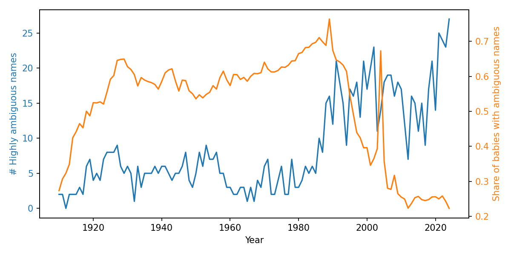

# Baby Names Analysis Results 🎯

## Data Format & Limitations
- **51 state files** (AK.TXT–WY.TXT + DC.TXT): `state,sex,year,name,count`
- **Years**: 1910–present (~6.6M total records)
- **Privacy**: ≥5 occurrences only per state/year
- **Limitations**: SSN coverage gaps, no demographics [web:17]

## Part A: Descriptive Analysis ✅

### Most Popular Name All-Time
| name  | count   |
|-------|---------|
| James | 5,089,997 |

### Most Gender-Ambiguous Names
| Year | Top Name | M | F | Total | Ratio |
|------|----------|---|----|-------|--------|
| **2013** | Unknown | 47 | 47 | 94 | **1.00** |
| **1945** | Unknown | 74 | 70 | 144 | **0.946** |

### Largest Trends Since 1980 (1980-84 vs 2015-19)
| Metric | Name     | Base | Recent | % Change |
|--------|----------|------|--------|----------|
| **📈 Increase** | Isabella | 90 | 73,748 | **+818%** |
| **📉 Decrease** | Kristi   | 10,449 | 5 | **-99.95%** |

## Part B: Gender Ambiguity Evolution 📊


**Key Insight**: Highly ambiguous names (M/F ratio ≥0.8) show cultural shift toward gender-neutral naming patterns.


### Sample Gender Ambiguity Data

### Sample Gender Ambiguity Data

### Sample Results (ambiguity_summary.csv)
```csv
year,num_highly_ambiguous_names,share_babies_ambiguous
1910,2,0.27353087577061114
1911,2,0.30673142178486595
1912,0,0.3233341291255445
1913,2,0.3485038067154914
```

**Full dataset**: Run `python run_all.py` locally
